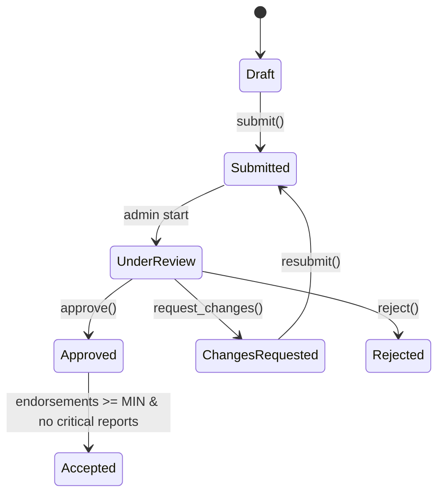

# 🏗️ Architecture — Heritage Network

---

## Database (Simplified ERD)

**Users**

-   id, username, email, role
-   relations: posts, followers/following

**Posts**

-   id, user_id, body, status, verification_state
-   relations: media, comments, likes, hashtags, reviews, endorsements, reports

**PostMedia**

-   id, post_id, path, type, order

**Comments**

-   id, post_id, user_id, body, parent_id
-   relations: likes

**ExpertEndorsements**

-   id, post_id, expert_id, decision, note
-   relation: post, expert

**Reviews**

-   id, post_id, reviewer_id, action, note

**Reports**

-   id, user_id, target_type, target_id, severity, status

**Follows**

-   follower_id, followed_id

**Hashtags & Pivot**

-   hashtags.id, tag
-   hashtag_post: post_id, hashtag_id

**Categories**

-   id, name, type

**Locations**

-   id, country, city, lat, lng

---

## State Machine (Posts)

